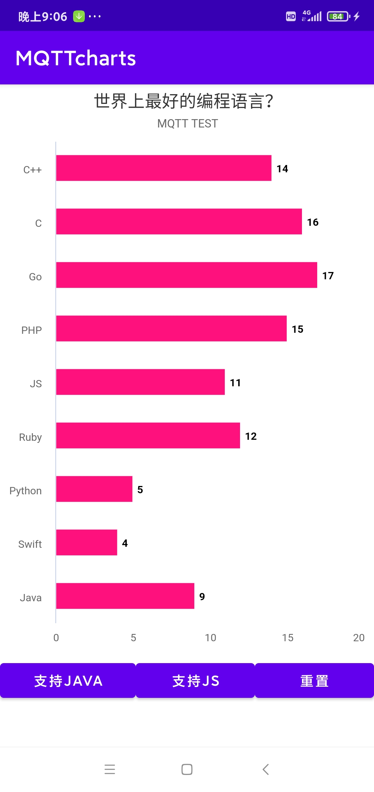
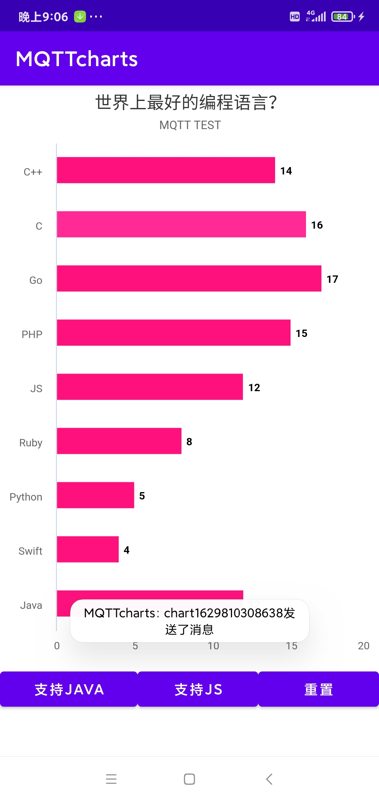
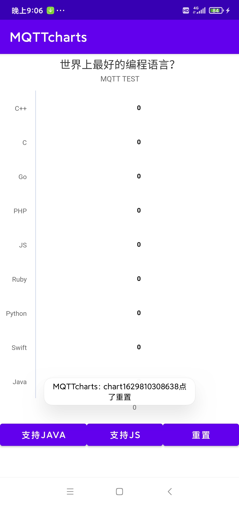

# Task-2-Android
基于环信MQTT开发的实时图表Android版，实现多终端互动
 
## 1 功能介绍
### 1.1 系统功能
#### 1.1.1 配置说明
* 配置文件在MainActivity.java中，同一协作团队MQTT配置须一致
* 生成apk后，设备须在**联网环境**下使用

#### 1.1.2 运行应用
* 应用启动时可以从Logcat看到MQTT相关日志：
  * MQTT客户端初始化
  * 获取token
  * 用户注册（已注册用户提示注册失败，不影响）
  * 用户登录
  * MQTT客户端连接云端
* 启动成功后界面如下：
 
### 1.2 业务功能
#### 1.2.1 点击柱状条
* 可以直接点击响应的柱状条给其投票
* 每点击一次增加一票
* 
#### 1.2.2 点击按钮“JAVA”
* 点击按钮“支持Java”
* 可以看到Java在图表中的Bar增加1
* 同时推送到其他用户
* 其他用户收到消息更新自己图表

#### 1.2.2 点击按钮“JS”
* 点击按钮“支持JS”
* 可以看到JS在图表中的Bar增加1
* 同时推送到其他用户
* 其他用户收到消息更新自己图表

#### 1.2.4 点击按钮“重置”
* 点击按钮“重置”
* 可以看到图表中的数据都归零
* 同时推送到其他用户
* 其他用户收到消息更新自己图表

<!-- ROADMAP -->
## 2 技术组件
- [x] MQTT
- [x] AAChart
- [x] okhttp3

<!-- GETTING STARTED -->
## 2 快速上手

1. 克隆代码 (`git clone https://github.com/supmaster/Task-2-Android.git`)
2. 本地准备好Android开发环境，如jdk、sdk等
3. 用Android Studio打开项目
4. 执行Gradle Sync
5. 运行项目
> 注意：须在MainActivity.java中补充MQTT相关配置

<!-- LICENSE -->
## 3 开源协议

基于 Apache 开源协议. 点击 `LICENSE` 查看更多信息

<!-- CONTACT -->
## 4 联系作者

Supmaster - [@github_handle](https://github.com/supmaster) - email

Project Link: [https://github.com/supmaster/Task-2-Android](https://github.com/supmaster/Task-2-Android)

<!-- ACKNOWLEDGEMENTS -->
## 5 致谢

- [x] [环信](https://console.easemob.com)
- [x] [IM Geek]()
- [x] 社群小姐姐 :girl:

[回到顶部](#readme)
